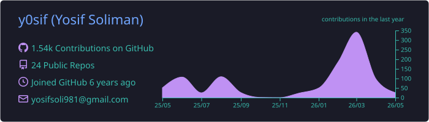
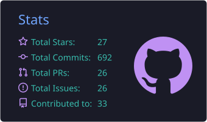
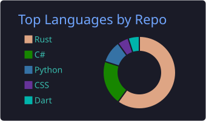
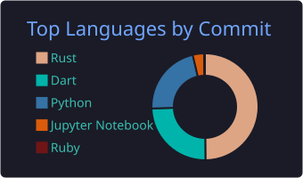

# Yosif Soliman

AI engineer. I mostly write Rust and build tools I want to use.

Right now I'm building [whisrs](https://github.com/y0sif/whisrs), voice-to-text dictation for Linux.

I contribute to open source when I can, notably [Hive](https://github.com/aden-hive/hive), an agent framework by Aden.

[LinkedIn](https://www.linkedin.com/in/y0sif) · [Email](mailto:yosifsoli981@gmail.com)

---

  

  

  
  

